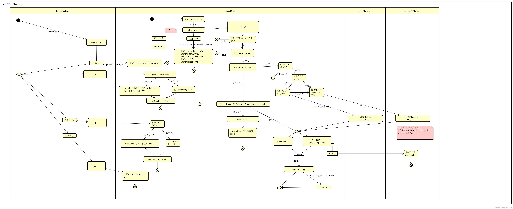

# 介绍

这是一个展示一句话的渐进式增强网页应用（PWA），你可以将自己喜欢的句子添加到自己的句集里面，然后在首页展示。（ps: 要是能够获取句子迷网站的数据就好了。）

Android，iOS平台上有一些一言客户端，这个是PWA版的！在Android平台使用Google浏览器体验更加。

# HitokotoDirver模块

`/app/API/hitokotoDriver.js`是完全依照照这张活动图编写的，所以代码中注释没有很多。错误处理和等待队列，是后来开发中遇到的问题所采用的方法，未更新到图中。

# 开发

为了安全性，后台代码暂时不开放，1年后无论是否网站是否还在运行，后台代码再开放。如果真想参与开发，那么我会尝试去掉后台中安全性的代码并开源，但是这需要一定的时间。

